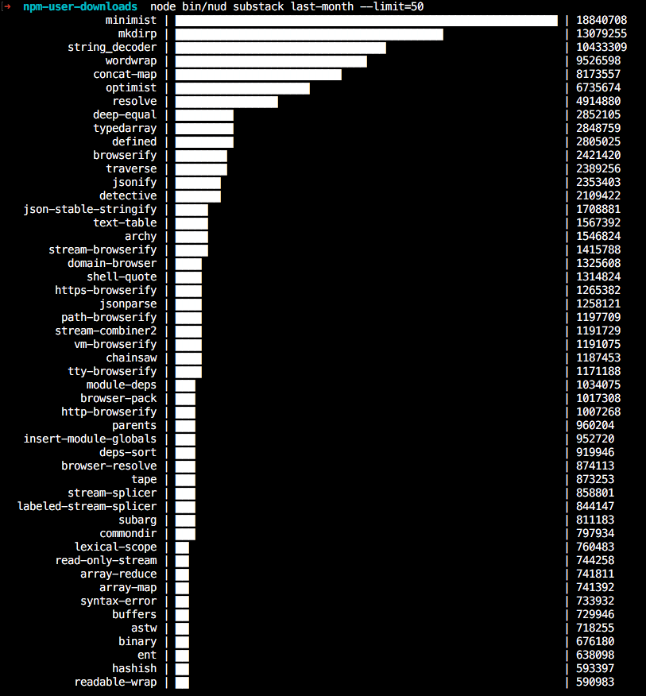

## npm-user-downloads

List npm user all modules download counts.

### Install

    npm i npm-user-downloads [-g]

### Usage

```
npmUserDownloads(user, period)
```

- user: npm user, eg: 'substack'
- period:
  - semantic: last-day, last-week, last-month
  - specific date: 2016-01-01
  - specific range: 2016-01-01:2016-01-31

### Example

```
npmUserDownloads('substack', 'last-month').then(function (res) {
  console.log(res);
});
```

```
nud substack last-month --limit=50
```



### License

MIT
